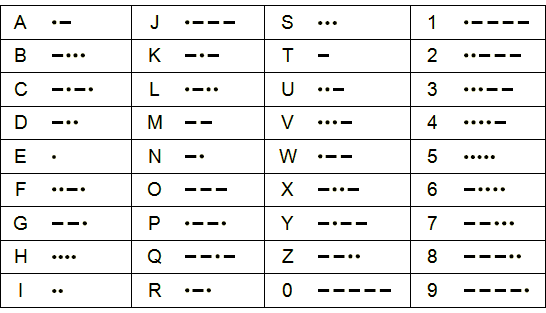
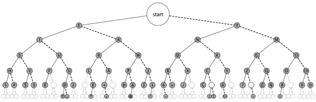

# Morse Talk
Morse Talk is a Python library which deals with [Morse code](http://en.wikipedia.org/wiki/Morse_code)

## Examples
```python
>>> import morse_talk as mtalk

# Encoding in morse
>>> mtalk.encode('Alpha Ranger 45 departed')
'.-   .-..   .--.   ....   .-       .-.   .-   -.   --.   .   .-.       ....-   .....
       -..   .   .--.   .-   .-.   -   .   -..'

# Encoding using binary pattern
>>> mtalk.encode('Alpha Ranger 45 knocked down', encoding='binary')
'1111000111111000111111110001111000111100000001111100011110001111000111111100010001111
10000000111111100011111000000011111110001111000111111111000111111110001111111000100011
11100000001111100011111111100011111110001111'

# Decoding a code encoded in morse
>>> code = '-...   ---   --   -...       -..-       .--.   --'
>>> mtalk.decode(code)
'bomb x pm'
```

## Morse Code
Morse code is a method of transmitting text information as a series of on-off
tones, lights, or clicks that can be directly understood by a skilled listener 
or observer without special equipment. The International Morse Code encodes the
ISO basic Latin alphabet, some extra Latin letters, the Arabic numerals and a 
small set of punctuation and procedural signals as standardized sequences of 
short and long signals called "dots" and "dashes", or "dits" and "dahs". 
Because many non-English natural languages use more than the 26 Roman letters, 
extensions to the Morse alphabet exist for those languages.



International Morse code is composed of five elements:

* short mark, dot or "dit" (·) : "dot duration" is one time unit long
* longer mark, dash or "dah" (–) : three time units long
* inter-element gap between the dots and dashes within a character : one dot duration or one unit long
* short gap (between letters) : three time units long
* medium gap (between words) : seven time units long

